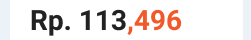

# angular-colorize-filter
> This is the function to make custom filter on angularjs view, i made it for filtering the string of the number and colorize the character in IDR currency

## Case




I want to colorize my string like image above, i use angularjs filter to solve the problem. With ng bind html directive, i return the html code for my filter result and i decide how much digit what i want to colorize it. This is the sample to use it.

## Example View


- markup

```diff
<p>
    <span>Rp.</span>
    <span ng-bind-html="total | DigitColorize:3"></span>
</p>
```

- style

```diff
.colorize {
    color: #FF3800;
}
```


